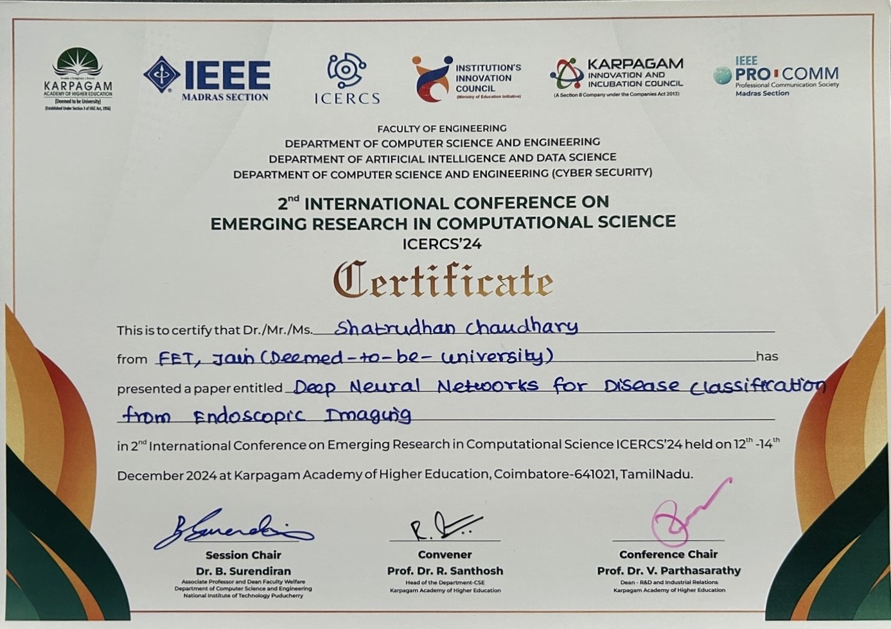
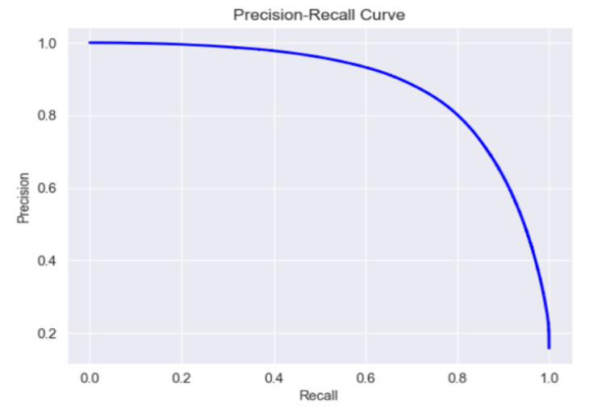
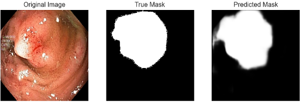
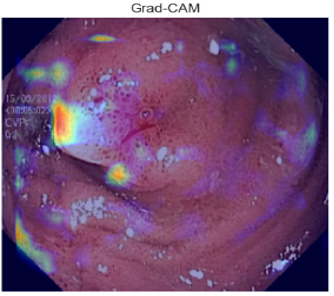

# Deep Neural Networks for Disease Classification from Endoscopic Imaging

[](https://ieeexplore.ieee.org/document/10895860)
[](https://ieeexplore.ieee.org/document/10895860)
[](https://github.com/jassatish/Deep-Neural-Networks-for-Disease-Classification-from-Endoscopic-Imaging)
[](https://github.com/jassatish/Deep-Neural-Networks-for-Disease-Classification-from-Endoscopic-Imaging/commits/main)
[](https://orcid.org/0009-0003-6690-3624)

---

> **Official code for the IEEE-published paper:**  
> [Deep Neural Networks for Disease Classification from Endoscopic Imaging](https://ieeexplore.ieee.org/document/10895860), presented at [ICERCS 2024](https://icercs.com), Coimbatore, India.

---

## 🏅 Conference Presentation Certificate

<div align="center">
  
</div>

---

## 📑 Abstract

The GI tract is prone to various diseases, and early detection is vital. Traditional endoscopic diagnosis is manual and subject to error. This work presents a deep learning-based model (U-Net) for automated disease classification and segmentation from endoscopic images, validated on the KVASIR dataset. The model achieved **98.80% accuracy**, surpassing previous benchmarks (e.g., ResNet101: 98.37%). Grad-CAM visualizations confirm the model's reliability and transparency for clinical use.  
**Read the full methodology and results in our [IEEE Xplore paper](https://ieeexplore.ieee.org/document/10895860).**

**Keywords:** Gastrointestinal tract, Endoscopy, CNN, Deep Learning, Automated Diagnosis, U-Net, KVASIR Dataset

---

## 🧑‍🔬 Authors

- **Shatrudhan Chaudhary**, Mithu Roy, Rupak Aryal, Mahesh T R, Pragyan Dhungana, Ranjan Kumar Rajbanshi  
  Dept. of Science and Technology, FET, Jain (Deemed-to-be University), Bangalore

---

## 📰 Table of Contents

- [Introduction](#introduction)
- [Dataset](#dataset)
- [Model Architecture](#model-architecture)
- [Training Details](#training-details)
- [Results & Visualizations](#results--visualizations)
- [Grad-CAM Explainability](#grad-cam-explainability)
- [How to Run](#how-to-run)
- [Citation](#citation)
- [Contact](#contact)

---

## 🚀 Introduction

Gastrointestinal (GI) diseases are a global health burden, and **early detection** is crucial. Manual endoscopic analysis is subjective, error-prone, and time-consuming.  
**Deep learning**—especially Convolutional Neural Networks (CNNs) and architectures like U-Net—enables accurate, automated detection of abnormalities in endoscopic images.

**Highlights:**
- U-Net-based model for segmentation/classification
- Validated on the [KVASIR dataset](https://www.kaggle.com/datasets/abdallahwagih/kvasir-dataset-for-classification-and-segmentation)
- Transfer learning and data augmentation for robust results
- High clinical relevance and transparency via Grad-CAM

---

## 📂 Dataset

- **KVASIR:** Multi-class annotated GI endoscopic images ([dataset link](https://www.kaggle.com/datasets/abdallahwagih/kvasir-dataset-for-classification-and-segmentation))
- **Preprocessing:** Images resized to 256×256, normalization, augmentation (rotation, flip, zoom)

---

## 🏗️ Model Architecture

- **Base:** U-Net encoder–decoder with skip connections
- **Input:** 256×256×3
- **Output:** Segmentation mask (lesion vs. background)
- **Total Parameters:** 31,031,745

**Layer configuration:**  
| Stage            | Block Details                             | Output Shape     | Parameters   |
|------------------|-------------------------------------------|------------------|--------------|
| Input Layer      | -                                         | (256, 256, 3)    | 0            |
| Encoder Block 1  | 2×Conv2D(64), MaxPooling2D                | (128, 128, 64)   | 38,720       |
| Encoder Block 2  | 2×Conv2D(128), MaxPooling2D               | (64, 64, 128)    | 221,440      |
| Encoder Block 3  | 2×Conv2D(256), MaxPooling2D               | (32, 32, 256)    | 885,248      |
| Encoder Block 4  | 2×Conv2D(512), MaxPooling2D               | (16, 16, 512)    | 3,539,968    |
| Bottleneck       | 2×Conv2D(1024)                            | (16, 16, 1024)   | 14,157,824   |
| Decoder Block 1  | Conv2DTranspose, 2×Conv2D(512)            | (32, 32, 512)    | 9,176,576    |
| Decoder Block 2  | Conv2DTranspose, 2×Conv2D(256)            | (64, 64, 256)    | 2,621,728    |
| Decoder Block 3  | Conv2DTranspose, 2×Conv2D(128)            | (128, 128, 128)  | 737,536      |
| Output Layer     | Conv2D(1)                                 | (256, 256, 1)    | 65           |

---

## 🏋️ Training Details

- **Loss:** Binary Cross-Entropy
- **Optimizer:** Adam (lr=0.001)
- **Metrics:** Accuracy, ROC-AUC, Precision, Recall, F1-Score
- **Augmentation:** Rotation, flipping, zoom for robust generalization

---

## 📈 Results & Visualizations

**Performance Metrics:**

| Metric     | Value      |
|------------|------------|
| Accuracy   | **98.80%** |
| AUC        | 0.97       |
| Precision  | High       |
| Recall     | High       |

---

### Plots

<table>
  <tr>
    <td><br><div align="center"><b>Accuracy over epochs</b></div></td>
    <td><br><div align="center"><b>Loss over epochs</b></div></td>
  </tr>
</table>

---

### Confusion Matrix

<div align="center">
  <br>
  <b>Confusion Matrix</b>
</div>

---

### Precision-Recall Curve

<div align="center">
  <br>
  <b>Precision-Recall Curve</b>
</div>

---

### Segmentation Output

<div align="center">
  
  <br>
  <b>Original Image &nbsp; | &nbsp; True Mask &nbsp; | &nbsp; Predicted Mask</b>
</div>

---

## 🖼 Grad-CAM Explainability

Grad-CAM heatmaps provide insight into model attention, validating that predictions focus on relevant image regions (lesions/abnormalities).

<div align="center">
  
  <br>
  <b>Grad-CAM Heatmap</b>
</div>

---

## 💻 How to Run

1. **Clone this repo**
    ```bash
    git clone https://github.com/jassatish/Deep-Neural-Networks-for-Disease-Classification-from-Endoscopic-Imaging.git
    cd Deep-Neural-Networks-for-Disease-Classification-from-Endoscopic-Imaging
    ```

2. **[Optional] Create & activate a virtual environment**
    ```bash
    python -m venv venv
    source venv/bin/activate  # or venv\Scripts\activate on Windows
    ```

3. **Install all required dependencies**
    ```bash
    pip install -r requirements.txt
    ```
    *(If you don't have a requirements.txt, list the key packages, e.g. `pip install numpy pandas matplotlib tensorflow keras scikit-learn seaborn`)*

4. **Download the [KVASIR dataset](https://datasets.simula.no/kvasir/) and place the images in a folder called `/data` (or update the path in the notebook if needed).**

5. **Open and run the Jupyter notebook**
    ```bash
    jupyter notebook endoscopy.ipynb
    ```
    - Or open `endoscopy.ipynb` with **VS Code**/**JupyterLab**/**Colab** and run all cells.

6. **Follow the notebook prompts to train, evaluate, and visualize the results.**

---

**Note:**  
- All training, evaluation, and visualization code is inside `endoscopy.ipynb`.
- For help or troubleshooting, see the comments and section headers in the notebook.

---

[](https://colab.research.google.com/github/jassatish/Deep-Neural-Networks-for-Disease-Classification-from-Endoscopic-Imaging/blob/main/endoscopy.ipynb)

---

## 📖 Citation

If you use this work, **please cite:**

```bibtex
@inproceedings{jaiswal2024deep,
  title={Deep Neural Networks for Disease Classification from Endoscopic Imaging},
  author={Chaudhary, Shatrudhan and Roy, Mithu and Aryal, Rupak and Mahesh, T R and Dhungana, Pragyan and Rajbanshi, Ranjan Kumar},
  booktitle={2024 International Conference on Emerging Research in Computational Science (ICERCS)},
  year={2024},
  publisher={IEEE},
  doi={10.1109/ICERCS57790.2024.10895860},
  url={https://ieeexplore.ieee.org/document/10895860}
}
